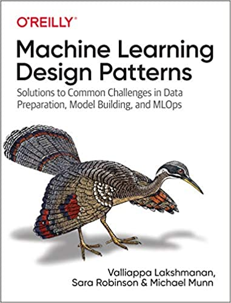

# MLOps-Jupyter-Templates

# Why Jupyter Templates?
There are many code based MLOps frameworks, such as Tensorflow Extended and Kubeflow. You have to check the tutorial, reference a lot to build your pipeline. Although the code is easy, the coding is boring and annoying.

At the same time, there are some GUI based MLOps services, such as GCP Vertex AI service. But the functions are limited and lacking flexibility.

A code based MLOps template can combine the advantages of code and GUI together.

1.All functions are implemented by code so that the following modification is easy. And the code can be continuously improved. 

2.Some pre-built charts and comments can make the code easy to understand.

So, I prefer code based MLOps templates. Technically and conveniently, I mean Jupyter notebook based templates.

# Which MLOps framework?
I used TFX, Kubeflow, GCP Vertex AI and AWS Sage Maker before.

Kubeflow is the most flexible, but the most heavy one. Unless you are willing to spend much time on infrastructure managing, I don't suggest setting up Kubeflow environment on your own.

TFX has more features and is tightly bundled with Tensorflow. At the same time, TFX can run in a normal Jupyter notebook. If you use Tensorflow, it's very convenient to use TFX.

GCP Vertex is serverless service, which can run Kubeflow code and TFX code under the hood.

AWS Sage Maker is similar to GCP Vertex AI, which has less features.

I will focus on TFX and Kubeflow code.

# TFX vs Kubeflow
According to the official guidance (https://cloud.google.com/vertex-ai/docs/pipelines/build-pipeline):

## Which pipelines SDK should I use?
Vertex Pipelines can run pipelines built using the Kubeflow Pipelines SDK v1.6 or higher, or TensorFlow Extended v0.30.0 or higher.

If you use TensorFlow in an ML workflow that processes terabytes of structured data or text data, we recommend that you build your pipeline using TFX.

To learn more about building a TFX pipeline, follow the TFX getting started tutorials.
To learn more about using Vertex Pipelines to run a TFX pipeline, follow the TFX on Google Cloud tutorials.

For other use cases, we recommend that you build your pipeline using the Kubeflow Pipelines SDK. By building a pipeline with the Kubeflow Pipelines SDK, you can implement your workflow by building custom components or reusing prebuilt components, such as the Google Cloud pipeline components. Google Cloud pipeline components make it easier to use Vertex AI services like AutoML in your pipeline.
The real two options: (Kubeflow on GCP Vertex AI) and (TFX on Jupyter Notebook)
Generally speaking, TFX is a light solution for Tensorflow based solution. (Kubeflow on GCP Vertex AI) is a heavy but flexible solution.

## TFX can run independent of GCP
Of course, as the official guidance said you may run TFX on GCP Vertex AI. But TFX can run independently.

# Credit
I will collect and improve good MLOps templates CONTINOUSLY here. I will mention all the original authors.

# A Fluent MLOps template for Time Series Data

It is worth mentioning that I have another related repo, 
https://github.com/MRYingLEE/DeepTime-Deep-Learning-Framework-for-Time-Series-Forecasting. 

That repo reflects my idea on MLOps with time series data. 
I expect a fluent and flexible MLOps experience for all primary situations.

# Design Patterns in MLOps

There is a good summary on design patterns in machine learning,
https://github.com/GoogleCloudPlatform/ml-design-patterns .

It is not an official Google product, but from theValliappa Lakshmanan, **Director (Global Head), Data Analytics and AI Solutions, Google Cloud, and his colleague.

It is worth reading carefully. Its introduction can be found as the following: 

## ml-design-patterns
Source code accompanying O'Reilly book:  
**Title**: Machine Learning Design Patterns  
**Authors**: Valliappa (Lak) Lakshmanan, Sara Robinson, Michael Munn  

 https://www.oreilly.com/library/view/machine-learning-design/9781098115777/ </img>  

<a href="https://shop.aer.io/oreilly/p/machine-learning-design/9781098115784-9149">Buy from O'Reilly</a>  
<a href="https://www.amazon.com/Machine-Learning-Design-Patterns-Preparation/dp/1098115783">Buy from Amazon</a>  

We will update this repo with source code as we write each chapter. Stay tuned!

## Chapters

* Preface
* The Need for ML Design Patterns
* Data representation design patterns
  * #1 Hashed Feature
  * #2 Embedding
  * #3 Feature Cross
  * #4 Multimodal Input
* Problem representation design patterns
  * #5 Reframing
  * #6 Multilabel
  * #7 Ensemble
  * #8 Cascade
  * #9 Neutral Class
  * #10 Rebalancing
* Patterns that modify model training
  * #11 Useful overfitting
  * #12 Checkpoints
  * #13 Transfer Learning
  * #14 Distribution Strategy
  * #15 Hyperparameter Tuning
* Resilience patterns
  * #16 Stateless Serving Function
  * #17 Batch Serving
  * #18 Continuous Model Evaluation
  * #19 Two Phase Predictions
  * #20 Keyed Predictions
* Reproducibility patterns
  * #21 Transform
  * #22 Repeatable Sampling
  * #23 Bridged Schema
  * #24 Windowed Inference
  * #25 Workflow Pipeline
  * #26 Feature Store
  * #27 Model Versioning
* Responsible AI
  * #28 Heuristic benchmark
  * #29 Explainable Predictions
  * #30 Fairness Lens
* Summary
